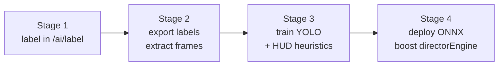

# Shinobi Striker CV roadmap

This document is the honest pipeline from the **AI label tool** (`/ai/label`)
that ships today, to a real-time event detector that feeds the
[`directorEngine.ts`](../src/lib/directorEngine.ts) action curve. We can't
detect "ultimate used" yet — but we can build the pipeline in four stages
without lighting cash on fire.

## What we're trying to detect

| Event | Why it matters | Visual cues |
| --- | --- | --- |
| `ultimate_used` | Highest-energy moment in any clip | Big colored aura overlay; on-screen cut-in art; HUD chakra bar empties |
| `jutsu_impact` | Mid-fight peak action | Particle burst at impact point; crit-screen flash |
| `flag_taken` | Objective beat (Base Battle / Flag CTF) | "Flag taken" banner; flag icon over player head |
| `player_killed` | Score moment | Red kill-feed line top-right; respawn timer overlay |
| `teabag` | Comedy moment | Crouch-spam motion of a player over a kill location |
| `scroll_grabbed` | Mid-fight resource grab | Scroll model pickup VFX + counter increment |

Most of these have **on-screen text or HUD overlays** that don't change
between matches — that's a huge break for us, because OCR/template
matching gets us 60-70% of the way before we ever train a real model.

## The four-stage pipeline



### Stage 1 — manual labeling (LIVE today)

- Tool: `/ai/label` writes rows to `public.frame_labels`.
- Goal: ~500 labeled events per `event_kind` ⇒ ~3000 timestamps total.
- Cost: $0. About 3-4 hours of human labor per event class once you find a
  rhythm. Recruit clan members; offer a Premium-tier credit per 100 labels.

### Stage 2 — frame extraction & export

Once we have enough labels, a small script (next to `scripts/youtube-uploader.ts`)
will:

1. SELECT `frame_labels` for a given source URL.
2. Call `yt-dlp -f best -o tmp.mp4 <url>`.
3. For each label `t`:
   - Sample a window: `t-0.25s, t, t+0.25s` (3 frames per event).
   - Save as `data/<event>/<source>_<t>.jpg` at 720p.
4. Push to a Roboflow workspace (free tier covers 10k images / month) or a
   Hugging Face dataset.

Script will land as `scripts/cv-export.ts`. Not built yet — pending Stage 1
hitting ~500 examples per class so we don't waste annotation time.

### Stage 3 — training

Two parallel tracks; we ship whichever fires first:

**Track A — heuristics (fastest).** A lot of these events are HUD overlays.
We can detect "VICTORY", "DEFEAT", and the kill feed via Tesseract or simple
template matching today. We already use Tesseract.js client-side for match
result OCR; same dependency, same install.

**Track B — YOLOv8n classifier on Roboflow / Colab.**

- Roboflow free tier: 1 worker, 10 hours / month — plenty for 5-10 model iterations.
- Colab Pro: $10/mo for an L4. Train ~30 epochs, expect mAP@0.5 ≥ 0.7 once
  we hit 500 examples per class.
- Output: `model.pt` → `model.onnx`.

Estimated cost: **$10–15 total** for the first usable model.

### Stage 4 — runtime deployment

We ship the ONNX model with `onnxruntime-web` (WebAssembly + WebGPU when
available) and run inference at 1 fps inside `directorEngine.ts`.

```
src/lib/cv/
  ├── onnx-loader.ts        // lazy-loads the model from a CDN URL
  ├── striker-detector.ts   // wraps inference; returns { event_kind, confidence }
  └── boost.ts              // adapter that maps detections to score boosts
```

The boost is consumed by `directorEngine.step()` via the `boost` callback
that's already in place — see how `youtubeActionCurve.ts` plugs in today.

Performance target: ~50 ms per inference on a 2020-era laptop. WebGPU on a
recent mac drops that to ~10 ms.

## What ships today vs. tomorrow

| Surface | Today | Tomorrow |
| --- | --- | --- |
| Label tool | ✅ `/ai/label` | — |
| `frame_labels` table | ✅ migration 012 | — |
| Per-user label list | ✅ in `/ai/label` | export bundle for Roboflow |
| HUD heuristics (VICTORY/DEFEAT) | ✅ via Tesseract.js OCR on screenshots | extend to live frame loop |
| YOLO model | — | ships when we have ~500/class |
| ONNX inference at runtime | — | ships behind `VITE_CV_DETECTOR=1` flag |

## Why we're not just calling Gemini / GPT-4o on every frame

- Cost: $0.0025 / frame × 60 fps × 4 minutes ≈ $0.60 per reel. Not viable
  on the free tier.
- Latency: round-trip to OpenAI/Gemini puts us at >1 s per frame, which
  defeats the action-curve loop.
- Privacy: gameplay footage is fine, but creators expect their content not
  to be shipped off-device by default.

For premium creators we may add a "boost reel with AI commentary" that does
hit a cloud LLM once per scene change — that's already covered by the
**.99-cent commentary add-on** in the existing pricing plan.
